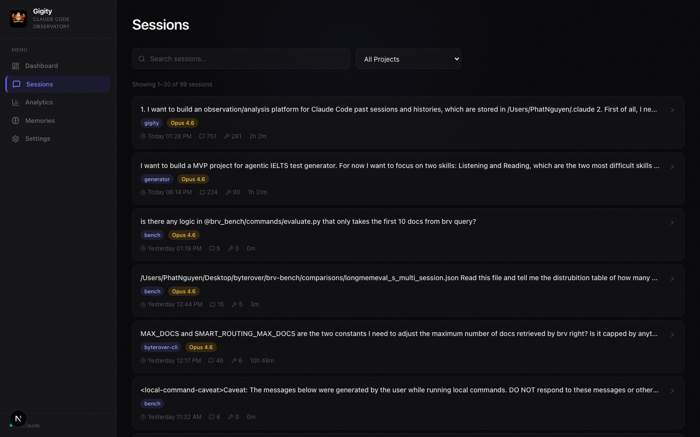
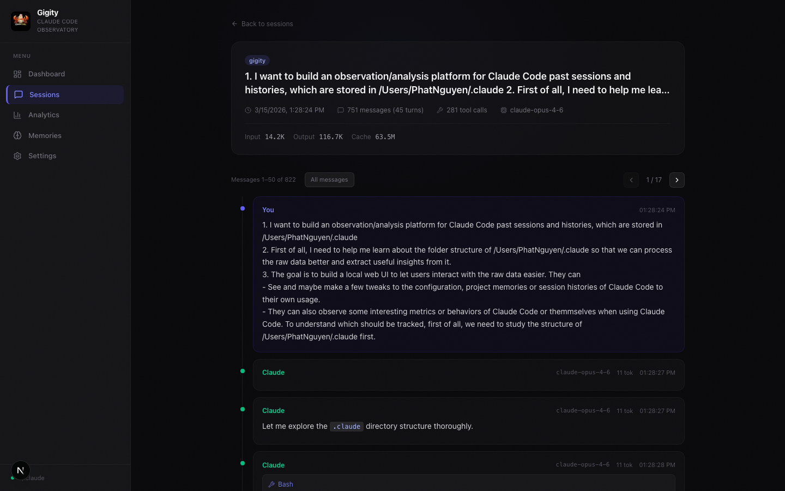
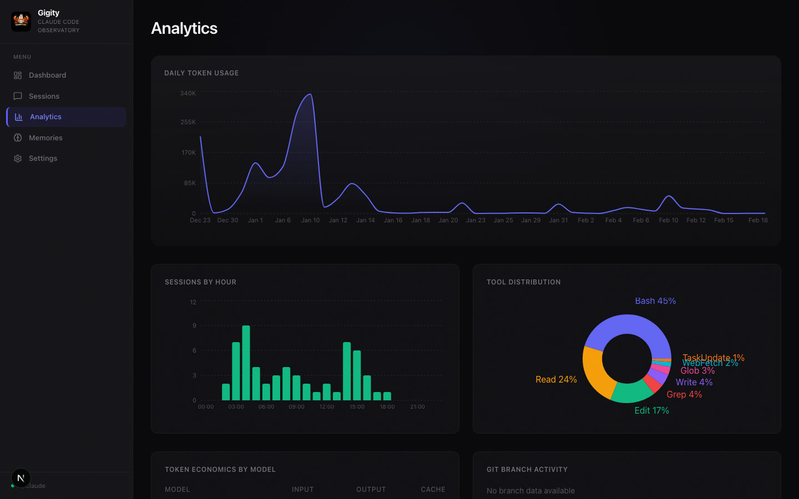
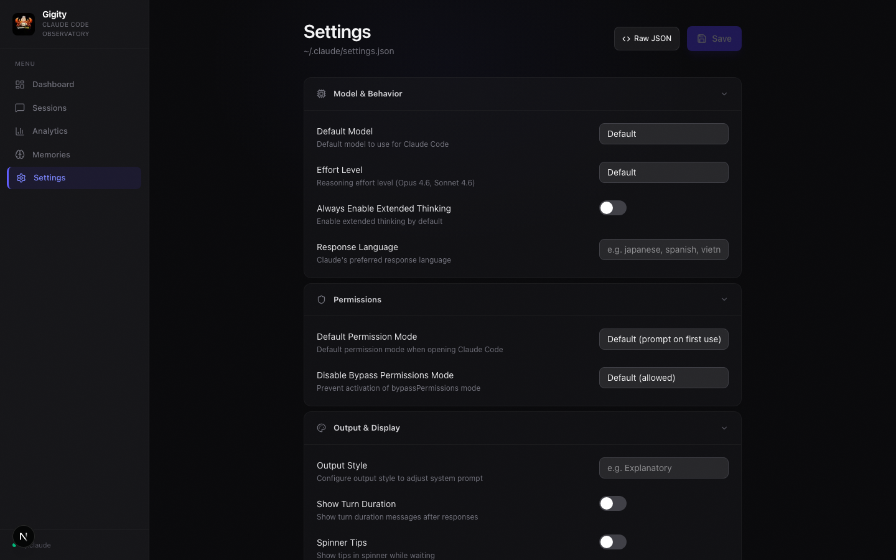

# Gigity — Claude Code Session Observatory

<p align="center">
  
</p>

<p align="center">
  A local web UI for observing, analyzing, and managing your <a href="https://claude.com/claude-code">Claude Code</a> session data.
</p>

---

Gigity reads the raw data stored in `~/.claude/` — session transcripts, usage stats, project memories, and settings — and presents it through an interactive dashboard. Everything runs locally. Your data never leaves your machine.

## Usage

### Dashboard
Overview stats, daily activity chart, model usage breakdown, top tools, and project leaderboard with token usage.


### Session Browser
Search and filter sessions by project, with metadata badges for model, git branch, message count, and duration.



### Session Replay
Full conversation replay with markdown rendering, collapsible thinking blocks, tool call details linked to their results, and a timeline view. Toggle between "All messages" and "Text only" modes. Paginated for large sessions.



### Analytics
Daily token usage trends, sessions by hour, tool distribution, model token economics, and git branch activity.



### Settings
Form-based editor for `~/.claude/settings.json` with dropdowns, toggles, and text inputs for all documented Claude Code settings. Toggle to raw JSON when needed.



## Features

| Feature | Description |
|---|---|
| **Session Browser** | Search, filter by project, paginated session list with metadata |
| **Session Replay** | Full conversation with markdown, thinking blocks, tool calls, tool results linked by ID |
| **Text-Only Mode** | Strip tool calls to see just the human/Claude conversation |
| **Usage Analytics** | Daily tokens, peak hours, tool distribution, model comparison, git branch activity |
| **Memory Manager** | Browse, edit, and delete project memories and MEMORY.md indexes |
| **Settings Editor** | Form UI for all documented Claude Code settings with raw JSON fallback |
| **Token Economics** | Per-project and per-model input/output/cache token breakdown |
| **Incremental Sync** | SQLite indexing with mtime-based incremental updates (~1s for 100 sessions) |

## Quick Start

**Prerequisites:** Node.js 20+, pnpm

```bash
git clone https://github.com/RyanNg1403/gigity.git
cd gigity
pnpm install
pnpm dev
```

Open [http://localhost:3000](http://localhost:3000) and click **Sync Data** to index your `~/.claude/` sessions.

## Tech Stack

- **Framework:** Next.js 16 (App Router) + TypeScript
- **Database:** SQLite via better-sqlite3 (`~/.claude/gigity.db`)
- **UI:** Tailwind CSS v4 + Lucide icons
- **Charts:** Recharts
- **Markdown:** react-markdown + remark-gfm

## Data Sources

All data is read from `~/.claude/`:

| Source | Path | What it provides |
|---|---|---|
| Session transcripts | `projects/{project}/{sessionId}.jsonl` | Full conversations, tool calls, token usage |
| Session index | `projects/{project}/sessions-index.json` | Session summaries, timestamps, message counts |
| Stats cache | `stats-cache.json` | Aggregated daily activity, model usage |
| Project memories | `projects/{project}/memory/` | MEMORY.md index + individual memory files |
| Settings | `settings.json` | User configuration |

## Architecture

- **`POST /api/sync`** — Scans `~/.claude/projects/`, parses JSONL files, populates SQLite. Atomic per-session transactions. Incremental by file mtime.
- **`GET /api/sessions/[id]`** — Reads JSONL on demand for full conversation replay.
- **`GET /api/analytics`** — Aggregated queries from SQLite.
- **`GET/PUT/DELETE /api/memories`** — Server-side path resolution with traversal protection.
- **`GET/PUT /api/settings`** — Read/write with backup before overwrite.

## Privacy

Gigity runs entirely on your local machine. No telemetry, no external requests, no data leaves your computer.

## License

MIT
