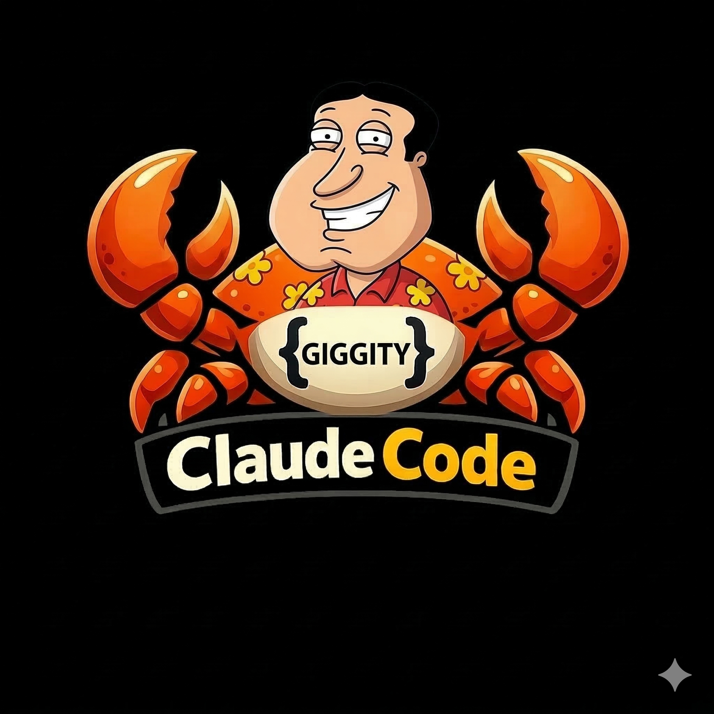
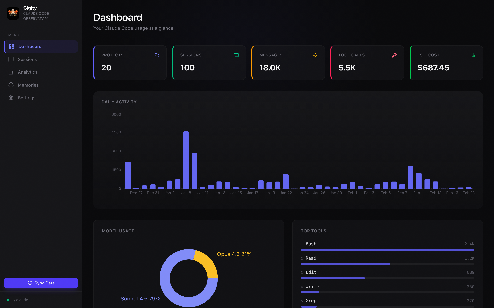

# ggt — Claude Code Session Toolkit

<p align="center">
  
</p>

<p align="center">
  Query, search, export, and transfer your <a href="https://claude.com/claude-code">Claude Code</a> sessions from the terminal.
</p>

---

`ggt` reads the raw data stored in `~/.claude/` — session transcripts, usage stats, project memories, and settings — indexes it into a local SQLite database, and gives you a CLI to query it. Transfer sessions between machines with full environment bundling so a teammate can pick up exactly where you left off.

Everything runs locally. Your data never leaves your machine.

## Quick Start

**Prerequisites:** Node.js 20+, pnpm

```bash
git clone https://github.com/RyanNg1403/gigity.git
cd gigity
pnpm install
pnpm build
```

This builds and globally links the `ggt` command. Verify:

```bash
ggt --version
```

Then sync your `~/.claude/` sessions into the database:

```bash
ggt sessions list
```

## Commands

```bash
ggt sessions list                                    # Recent 20 sessions
ggt sessions list --project=my-app --limit=10        # Filter by project
ggt sessions show f81f                               # Session details (prefix match)
ggt sessions export abc123 -o handoff.tar.gz         # Export session for handoff
ggt sessions import handoff.tar.gz --project-dir .   # Import on another machine
ggt messages list f81f --type=user --full             # Read messages from a session
ggt messages search "authentication" --project=my-app # Search across sessions
ggt projects list                                    # List all indexed projects
ggt sql "SELECT COUNT(*) FROM sessions"              # Raw SQL escape hatch
```

All commands support `--json` for piping to `jq` or other tools.

See [docs/ggt-cli.md](docs/ggt-cli.md) for the full reference.

## Session Export/Import

Transfer Claude Code sessions between machines so a teammate can resume where you left off.

```bash
# Export on your machine
ggt sessions export abc123 -o handoff.tar.gz

# Import on teammate's machine (interactive setup)
ggt sessions import handoff.tar.gz --project-dir /path/to/project
```

### What gets bundled

| Component | Description |
|---|---|
| Session transcript | Full JSONL conversation history |
| Subagents | Transcripts + metadata for spawned agents |
| Tool results | Cached tool outputs |
| File history | File snapshots at each edit |
| Project memories | MEMORY.md + individual memory files |
| MCP server configs | Server definitions with credentials redacted |
| Skills | Skill files used in the session |
| Agent definitions | Custom agent markdown files |
| Project hooks | Hook configs from `.claude/settings.json` |

### Interactive environment setup

On import, the recipient is prompted to install each bundled artifact:

```
Bundled MCP server configs (2):
  linear-server (stdio: npx)
    ⚠ 1 env var(s) redacted — you'll need to set: LINEAR_API_KEY
  slack (stdio: npx)
Install these MCP server configs? [Y/n]

Bundled skill files (1):
  commit (commit.md) — Smart git commit with conventional format
Install these skills? [Y/n]
```

The handoff message appended to the session tells Claude exactly what was installed and what was declined. Use `--yes` to accept everything without prompting.

After import, the session appears at the top of `claude --resume` (sorted by file mtime), and you're prompted to launch it immediately.

See [docs/session-export-import.md](docs/session-export-import.md) for the full guide.

## Data Sources

All data is read from `~/.claude/`:

| Source | Path | What it provides |
|---|---|---|
| Session transcripts | `projects/{project}/{sessionId}.jsonl` | Full conversations, tool calls, token usage |
| Session index | `projects/{project}/sessions-index.json` | Session summaries, timestamps, message counts |
| Stats cache | `stats-cache.json` | Aggregated daily activity, model usage |
| Project memories | `projects/{project}/memory/` | MEMORY.md index + individual memory files |
| Settings | `settings.json` | User configuration |

## Web UI

Gigity also includes a local web dashboard for visual exploration — session replay, analytics charts, memory manager, and settings editor.



```bash
pnpm web:dev    # Start the web UI on http://localhost:3000
```

See [docs/web-ui.md](docs/web-ui.md) for details.

## Tech Stack

- **CLI:** oclif + TypeScript (`ggt` command)
- **Database:** SQLite via better-sqlite3 (`~/.claude/gigity.db`)
- **Web UI:** Next.js 16 (App Router) + Tailwind CSS v4 + Recharts

## Privacy

Gigity runs entirely on your local machine. No telemetry, no external requests, no data leaves your computer.

## License

MIT
