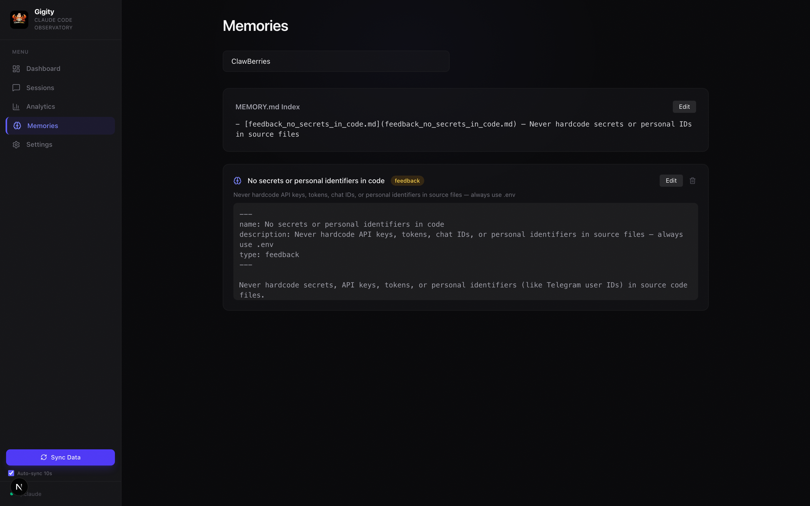

# Web UI

Gigity includes a local web dashboard for visual exploration of your Claude Code session data. It reads from the same SQLite database (`~/.claude/gigity.db`) as the `ggt` CLI.

## Quick Start

```bash
cd gigity
pnpm install
pnpm web:dev
```

Open [http://localhost:3000](http://localhost:3000) and click **Sync Data** in the sidebar to index your `~/.claude/` sessions.

## Pages

### Dashboard

Overview stats, daily activity chart, model usage breakdown, top tools, project leaderboard with estimated costs, and a global sync button in the sidebar accessible from any page.


### Session Browser

Search and filter sessions by project, with metadata badges for model, git branch, message count, and duration.


### Session Replay

Full conversation replay with markdown rendering, collapsible thinking blocks, tool call details linked to their results, and a timeline view. In-session search filters to matching messages with keyword highlighting. Text-only mode by default. Session insights (prompt effectiveness, context pressure, git activity) below the transcript.


### Analytics

Daily token usage trends, daily cost trend, sessions by hour, tool distribution, cost-by-model breakdown, git branch activity, prompt effectiveness score distribution, and daily effectiveness trend.


### Memory Manager

Browse, edit, and delete project memories with atomic file writes.



### Settings

Form-based editor for `~/.claude/settings.json` with Common/Advanced grouping, sticky section navigation, dropdowns, toggles, and text inputs. Raw JSON mode with guidance banner.


## Features

| Feature | Description |
|---|---|
| **Session Browser** | Search (FTS5-backed), filter by project, paginated session list with per-session cost |
| **Session Replay** | Full conversation with markdown, thinking blocks, tool calls, tool results linked by ID |
| **In-Session Search** | Filter messages by keyword with highlighting, fixed search bar, auto-scroll to matches |
| **Prompt Effectiveness** | Per-session scoring (0-100) measuring success rate, corrections, interruptions, error loops |
| **Text-Only Mode** | Strip tool calls to see just the human/Claude conversation (default view) |
| **Cost Tracker** | Estimated costs per session, project, model, and day using official Anthropic pricing |
| **Git-Diff Mapping** | Collapsible git activity section in session detail showing commits made during the session |
| **Context Pressure** | Area chart visualizing context window usage per turn with compression event markers |
| **Usage Analytics** | Daily tokens, daily cost trend, peak hours, tool distribution, cost-by-model breakdown, effectiveness trend |
| **Memory Manager** | Browse, edit, and delete project memories with atomic file writes |
| **Settings Editor** | Form UI with Common/Advanced grouping, sticky section nav, raw JSON fallback |
| **Auto-Sync** | 10-second polling with visibility-aware pause, plus manual sync button |
| **Incremental Sync** | SQLite indexing with mtime-based incremental updates (~1s for 100 sessions) |

## Tech Stack

- **Framework:** Next.js 16 (App Router) + TypeScript
- **Database:** SQLite via better-sqlite3 (`~/.claude/gigity.db`)
- **UI:** Tailwind CSS v4 + Lucide icons
- **Charts:** Recharts
- **Markdown:** react-markdown + remark-gfm

## Architecture

| Route | Purpose |
|---|---|
| `/` | Dashboard — overview stats, daily activity chart, model usage pie, top tools, project leaderboard |
| `/sessions` | Session browser — search, filter by project, paginated list |
| `/sessions/[id]` | Session replay — full conversation with thinking blocks, tool calls, token usage per turn |
| `/analytics` | Deep analytics — daily token usage, peak hours, tool distribution, model token breakdown, git branch activity |
| `/memories` | Memory manager — browse/edit/delete project memories (read-write) |
| `/settings` | Settings editor — view/edit `~/.claude/settings.json` (read-write) |

### API Endpoints

- **`POST /api/sync`** — Scans `~/.claude/projects/`, parses JSONL files, populates SQLite + FTS5 index. Atomic per-session transactions. Incremental by file mtime.
- **`GET /api/sessions/[id]`** — Reads JSONL on demand for full conversation replay with compression metadata.
- **`GET /api/sessions/[id]/git`** — Returns git commits made during the session by matching timestamps against the project repo.
- **`GET /api/analytics`** — Aggregated queries from SQLite with cost estimation per model and day.
- **`GET/PUT/DELETE /api/memories`** — Server-side path resolution with traversal protection and atomic writes.
- **`GET/PUT /api/settings`** — Read/write with atomic temp-file swap and backup before overwrite.
